# Simple Node.js App Deployment

This project demonstrates how to deploy a simple Node.js application.

##  Project Setup

### Step1: Launch an EC2 instance 

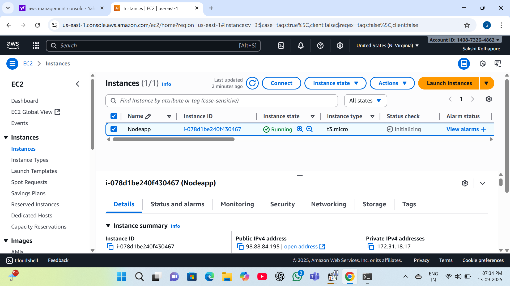

### Step2: Take access of EC2 instance

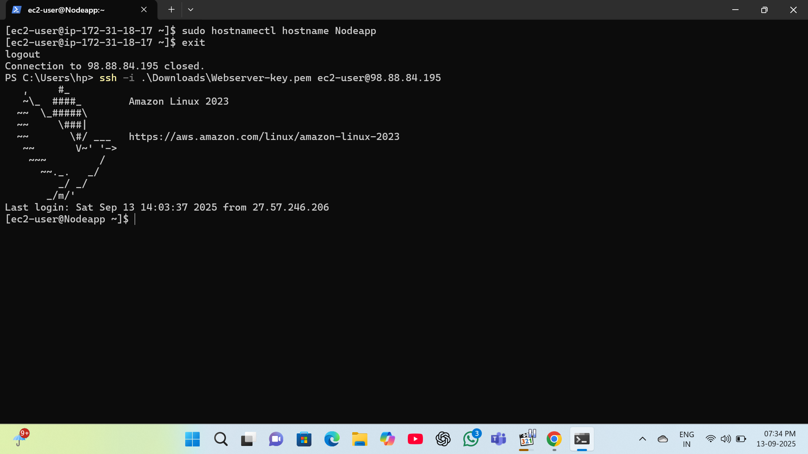

### Step3: Update the packages and install the **nodejs** webserver and package manager.

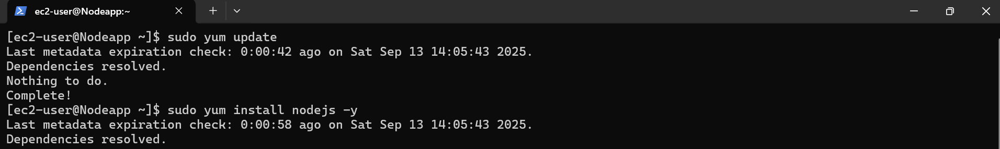

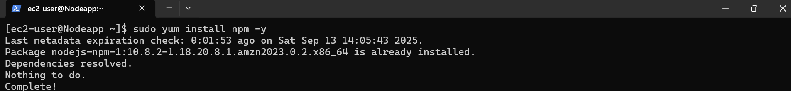

### Step4: Create nodeapp directory and go inside this directory.

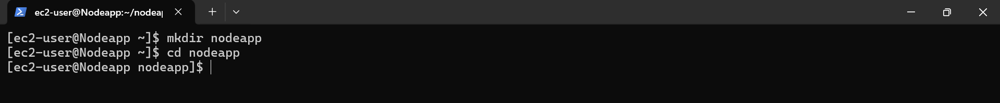

### Step5: Paste the URL taken from the git

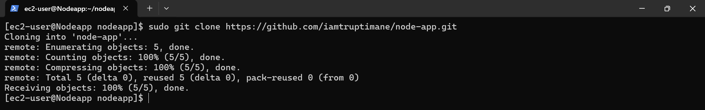

### Step6: Install all the dependacy from package.json file

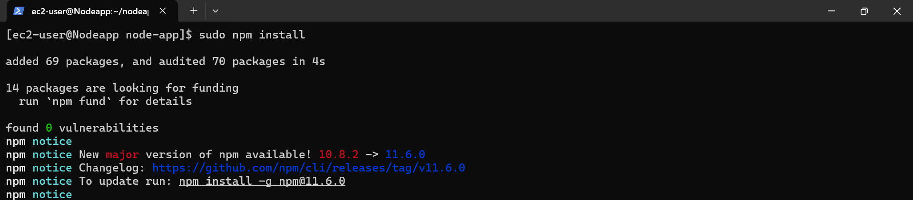

### Step7: Start the application

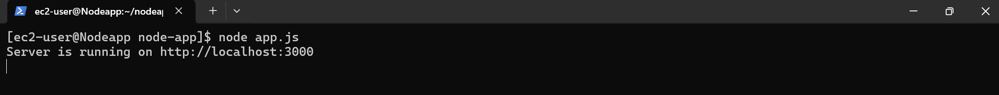

### Step8: Add 3000 port number to security group.

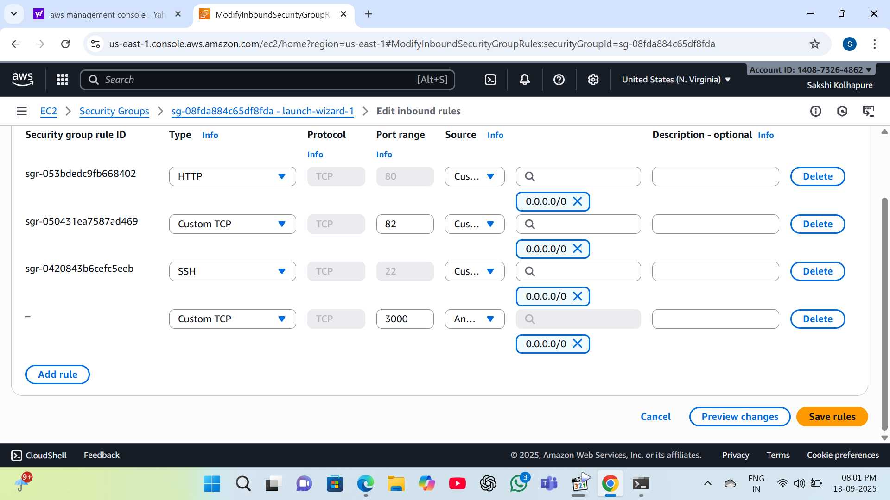

### Step10: To run the application at background install pm2 and start the app.js file

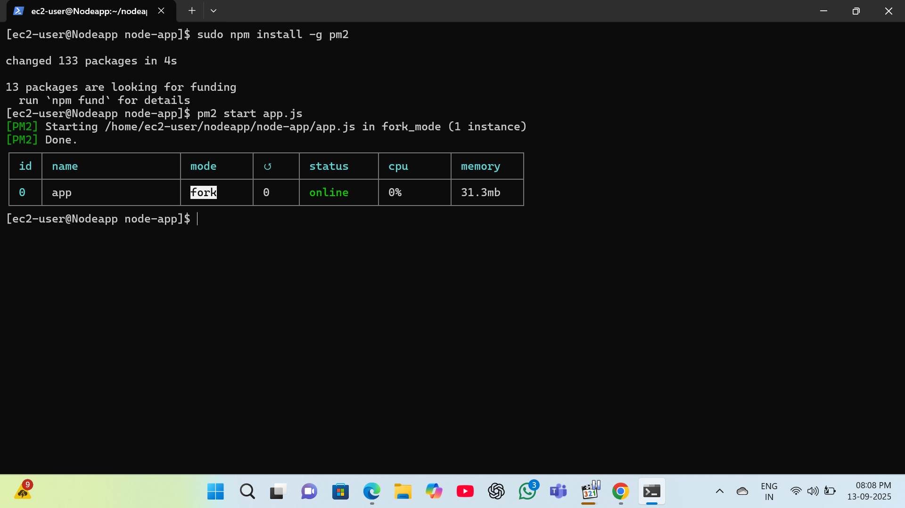

### Step11: Test the application using public IP address.

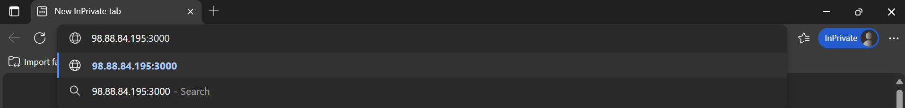

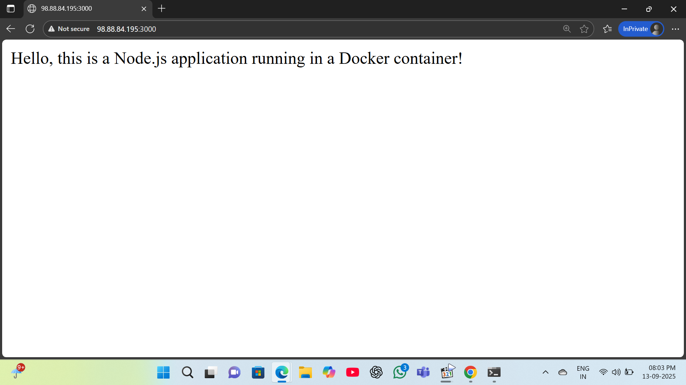

